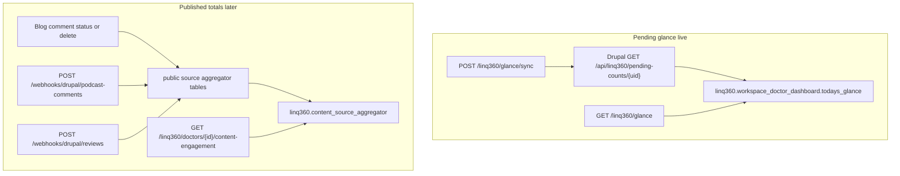
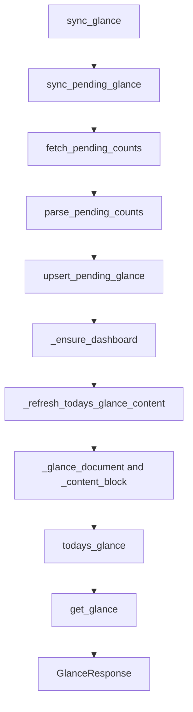
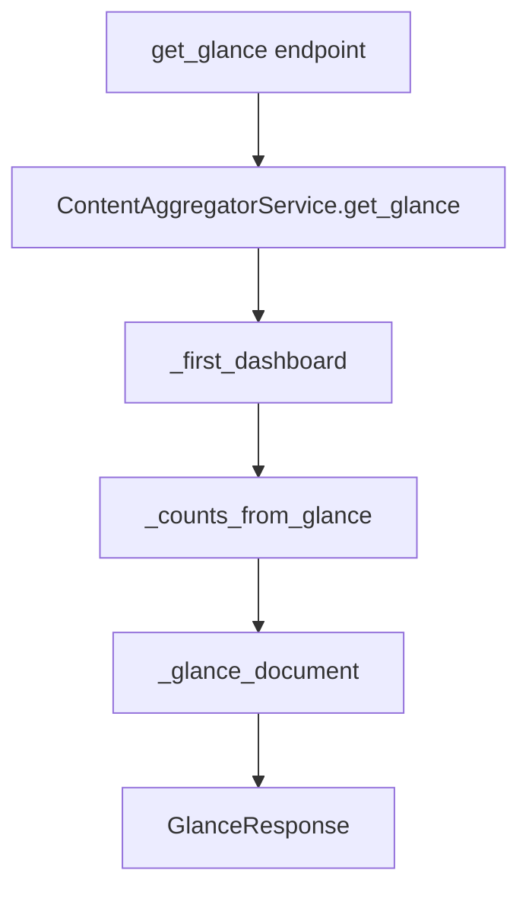

# LinQ360 end to end

Current map of the LinQ360 package: every file, every table, and how the code connects.

Local URLs use the app prefix `/caepy/api`. Step-by-step history is in [linq360_progress.md](linq360_progress.md).

Two workflows live in this package. They do not share a table.

| Workflow | What it stores | Live today |
|----------|----------------|------------|
| Pending glance | Drupal pending counts in `todays_glance` | Yes. Sync and get. |
| Published engagement | Approved or published totals in `content_source_aggregator` | Code exists. The table is empty until those events run. Drupal pending-counts does not send these totals. |

## DRY

Pending glance follows DRY.

- The three pending names exist once: `PENDING_SOURCES` = `reviews`, `blog_comments`, `podcast_comments` in `practice_hub_pending_client.py`.
- The three other cards exist once: `GLANCE_CARDS` = `appointments`, `requests`, `payments`.
- Drupal's `total_pending_counts` is not copied. `_content_block` sums the three counts whenever the JSON is built.
- `sync_pending_glance` saves the row, then calls `get_glance`. Sync and get return that one document through the same `GlanceResponse` model.
- A count is floored at 0 in `non_negative_int` only. The total is never incremented on its own.

Published engagement is a second path in the same service class. Glance does not call it. Blog and podcast comments share `_adjust_comments` and `_get_or_create_comments`. Reviews stay separate because they also store a rating. Every single-key insert goes through `_get_or_create_row`.

## File structure

```
src/app/linq360/
  __init__.py                      exports the ORM models
  api/
    __init__.py                    exports glance_router and content_engagement_router
    content_engagement.py          the three HTTP endpoints
  services/
    __init__.py                    exports ContentAggregatorService and blog_comment_delta
    practice_hub_pending_client.py Drupal GET, parse, shared names
    content_aggregator_service.py  Postgres read and write for both workflows
  schemas/
    __init__.py                    schema exports
    engagement.py                  glance and content-engagement JSON models
    dashboard.py                   appointments_json shape, not used at runtime yet
  models/
    __init__.py                    model exports
    dashboard.py                   linq360 dashboard tables
    aggregators.py                 rollup tables
    enums.py                       appointment enums
  repositories/
    __init__.py                    empty placeholder. No repository class yet.
  data/
    workspace_appointments.sample.json   example appointments_json. Not loaded by the app.
```

Routers are mounted in `src/app/api/v1/__init__.py` with prefix `/linq360`.

Callers outside the package:

| File | Why it imports LinQ360 |
|------|------------------------|
| `src/app/api/v1/__init__.py` | Mounts the two routers |
| `src/app/api/v1/endpoints/blogs.py` | Blog comment status, blog delete, podcast webhook, reviews webhook |
| `src/app/api/v1/endpoints/content_blogs.py` | Content-team blog comment status and blog delete |
| `src/app/models/__init__.py` | Registers models so Alembic sees the tables |
| `alembic/env.py` | Same registration for migrations |

## What each file contains, and why

### `api/content_engagement.py`

HTTP only. It does not talk to Drupal and it does not build the JSON by hand.

| Symbol | Why |
|--------|-----|
| `router` | JWT routes. Today: content-engagement. |
| `public_router` | Glance routes. No JWT, so a Drupal token is not required. |
| `require_doctor_engagement_access` | Admin, operation, content creator, or the doctor who owns `doctor_id`. |
| `get_content_engagement` | Calls `get_engagement`. |
| `get_glance` | Calls `ContentAggregatorService.get_glance`. |
| `sync_glance` | Calls `sync_pending_glance`. Drupal failure is HTTP 502. A non-numeric uid is HTTP 404. |

### `services/practice_hub_pending_client.py`

The only place that calls Drupal for glance.

| Symbol | Why |
|--------|-----|
| `PENDING_SOURCES` | The three count names, used by parse and by the glance JSON. |
| `GLANCE_CARDS` | `appointments`, `requests`, `payments`. Copied through, not filled by this client. |
| `PracticeHubPendingError` | Drupal was unreachable or did not return HTTP 200. |
| `non_negative_int` | Shared floor at 0. |
| `pending_count_from_block` | Reads `{ "pending_count": N }` from one Drupal block. |
| `parse_pending_counts` | Keeps the three counts. Ignores Drupal's total. |
| `fetch_pending_counts` | `GET {LINQMD_PRACTICE_HUB_API_URL}/api/linq360/pending-counts/{uid}` with the Practice Hub Basic token and cookie. |

### `services/content_aggregator_service.py`

All Postgres changes for LinQ360 go through `ContentAggregatorService`.

Glance functions:

| Function | Why |
|----------|-----|
| `_counts_from_glance` | Reads the three stored `pending_count` values. |
| `_content_block` | Builds `content`, including `total_pending_counts` as the sum. |
| `_glance_document` | One JSON for the database and both HTTP responses. Keeps existing cards. Drops `messages`. |
| `GlanceDashboardMissing` | Uid is not numeric, so it cannot be `user_id`. |
| `get_glance` | Read path. No Drupal call. |
| `upsert_pending_glance` | Write path. |
| `sync_pending_glance` | Fetch, upsert, then `get_glance`. |
| `_dashboards_for_uid` | Rows where `user_id` equals the Drupal uid. |
| `_ensure_dashboard` | Those rows, or one new row when none exist. |
| `_first_dashboard` | The row get uses when several appointments exist. |
| `_refresh_todays_glance_content` | Writes `_glance_document` onto every matching row. |

Published-metric functions (not used by glance):

| Function | Why |
|----------|-----|
| `blog_comment_delta` | +1 when a comment becomes approved, -1 when it leaves approved, else 0. |
| `adjust_blog_comments` | Updates `blog_comments_aggregator`, copies `item_count` to `content_source_aggregator` source `blog`. |
| `adjust_podcast_comments` | Same for podcast. |
| `adjust_reviews` | Published review count and rating. Does not write `todays_glance`. |
| `adjust_pending_reviews` | Webhook counter on `reviews_pending_aggregator` only. |
| `get_pending_reviews` | Read that webhook counter. |
| `get_engagement` | Read `content_source_aggregator` for the engagement API. |
| `rebuild_blog_comments` | Recount approved blog comments from CAEPY `blog_comments`. |
| `rebuild_podcast_comments` | Copy the existing podcast aggregator row onto the main table. No local podcast table yet. |
| `rebuild_reviews` | Recalculate `avg_rating` from the summary row. |
| `rebuild_all` | Runs the three rebuilds. |
| `_get_or_create_row` | Insert any single-key aggregator row on first use. |
| `_get_or_create_comments` / `_adjust_comments` | Shared blog and podcast comment path. |
| `_get_or_create_reviews` / `_main` / `_pending_reviews` | Review summary, published rollup, and webhook counter. |
| `_upsert_main_comments` / `_upsert_main_reviews` | Copy a source total into `content_source_aggregator`. |
| `_floor_non_negative` / `_avg_rating` | Published counts never go below 0. Average is `rating_sum / review_count`. |

### `schemas/engagement.py`

| Model | Why |
|-------|-----|
| `GlanceSyncRequest` | Body `{ "linqmd_user_id": "884" }`. |
| `PendingCount` | `{ "pending_count": N }`. |
| `GlanceContent` | Three counts plus `total_pending_counts`. |
| `GlanceResponse` | The document sync and get both return. |
| `ContentSourceEngagement` | One published source in the engagement response. |
| `ContentEngagementResponse` | `doctor_id`, `sources`, `total_item_count`. |

### `schemas/dashboard.py`

`WorkspaceAppointmentItem` is the planned shape of one object inside `appointments_json`: patient, appointment type, consultation type, time slot. Glance does not write this column. The sample file `data/workspace_appointments.sample.json` matches this model and is not loaded at runtime.

### `models/dashboard.py`

| Class | Table |
|-------|--------|
| `WorkspaceDoctorDashboard` | `linq360.workspace_doctor_dashboard` |
| `DoctorDashboard` | `linq360.doctor_dashboard` (primary key only) |

### `models/aggregators.py`

| Class | Schema | Table |
|-------|--------|--------|
| `BlogCommentsAggregator` | public | `blog_comments_aggregator` |
| `PodcastCommentsAggregator` | public | `podcast_comments_aggregator` |
| `ReviewsPendingAggregator` | public | `reviews_pending_aggregator` |
| `ReviewsSummaryAggregator` | public | `reviews_summary_aggregator` |
| `ContentSourceAggregator` | linq360 | `content_source_aggregator` |

`SOURCE_REVIEW`, `SOURCE_BLOG`, `SOURCE_PODCAST` are the only `source` values.

### `models/enums.py`

`AppointmentType`: `REQUEST`, `BOOKING`, `CALL`.

`ConsultationType`: `in-person`, `teleconsultation`.

Used by `WorkspaceAppointmentItem`. Not used by glance.

### `repositories/__init__.py`

Empty on purpose. Dashboard access is in the service. A repository can be added later without changing the HTTP layer.

## Schemas and tables

Two Postgres schemas. Seven tables.

### Schema `linq360` (3 tables)

**`workspace_doctor_dashboard`** — the live dashboard row.

| Column | Type | What is stored now |
|--------|------|--------------------|
| `appointment_id` | integer PK | Database-generated. |
| `workspace_id` | integer | `0` when glance sync created the row. |
| `user_id` | integer | Drupal uid, for example `884`. Not `doctors.id`. |
| `appointments_json` | jsonb | `{}`. Not filled yet. |
| `todays_glance` | jsonb | Pending glance JSON below. |

**`doctor_dashboard`** — shell for a later doctor-level dashboard.

| Column | Type |
|--------|------|
| `id` | integer PK |

No business columns yet.

**`content_source_aggregator`** — published totals. Empty until an approve or publish event runs. Unique `(doctor_id, source)`.

| Column | What to store |
|--------|----------------|
| `id` | Primary key. |
| `doctor_id` | `doctors.id`. |
| `source` | `review`, `blog`, or `podcast`. |
| `item_count` | Approved comments, or published reviews. |
| `avg_rating` | Reviews only. Otherwise null. |
| `rating_sum` | Reviews only. Otherwise null. |
| `metrics` | `{}`. |
| `updated_at` | Write time. |

### Schema `public` (4 tables)

These are source counters. Glance does not read them.

| Table | Key | What it stores |
|-------|-----|----------------|
| `blog_comments_aggregator` | `doctor_id` | `comment_count` of approved blog comments |
| `podcast_comments_aggregator` | `doctor_id` | `comment_count` of approved podcast comments |
| `reviews_summary_aggregator` | `doctor_id` | published `review_count`, `rating_sum`, `avg_rating`. Optional `linqmd_user_id`. `pending_count` here is not the glance badge. |
| `reviews_pending_aggregator` | `linqmd_user_id` | Webhook +1 / -1 counter. Optional `doctor_id`. Glance does not read it. |

`public.content_pending_glance` was created and then dropped. Do not add it back. Pending counts live in `todays_glance`.

## Whole LinQ360 workflow



## Glance sync

`POST /caepy/api/v1/linq360/glance/sync`

Body: `{ "linqmd_user_id": "884" }`. No doctor JWT.



1. `sync_glance` reads `GlanceSyncRequest`.
2. `fetch_pending_counts` calls Drupal.
3. `parse_pending_counts` returns `{ "reviews": N, "blog_comments": N, "podcast_comments": N }`.
4. `_ensure_dashboard` finds rows with that `user_id`, or inserts one (`workspace_id` 0, `appointments_json` `{}`).
5. `_glance_document` keeps `appointments`, `requests`, and `payments`, and replaces `content`.
6. `_content_block` sets `total_pending_counts` to the sum.
7. `get_glance` builds the same document again from the saved row.
8. `GlanceResponse` is the HTTP body.

Drupal down or not HTTP 200: HTTP 502, and `todays_glance` is left unchanged. Non-numeric uid: HTTP 404.

## Glance get

`GET /caepy/api/v1/linq360/glance?linqmd_user_id=884`

No Drupal call. No JWT.



Missing row: all three counts are 0, total is 0, and the three cards are `{}`.

Both routes return:

```json
{
  "content": {
    "reviews": { "pending_count": 2 },
    "blog_comments": { "pending_count": 1 },
    "podcast_comments": { "pending_count": 0 },
    "total_pending_counts": 3
  },
  "appointments": {},
  "requests": {},
  "payments": {}
}
```

## Published engagement

`GET /caepy/api/v1/linq360/doctors/{doctor_id}/content-engagement` requires a JWT. `doctor_id` is `doctors.id`.

`get_content_engagement` checks access, then `get_engagement` reads `content_source_aggregator` only.

Writes happen only as side effects:

| Call | Function | Table updated |
|------|----------|----------------|
| `PUT /caepy/api/v1/blogs/comments/{comment_id}/status` | `blog_comment_delta` then `adjust_blog_comments` | blog source + `content_source_aggregator` |
| `PUT /caepy/api/v1/content/doctors/{doctor_id}/blogs/comments/{comment_id}/status` | same | same |
| Blog delete | `adjust_blog_comments` with a negative count | same |
| `POST /caepy/api/v1/webhooks/drupal/podcast-comments` | `adjust_podcast_comments` | podcast source + main row |
| `POST /caepy/api/v1/webhooks/drupal/reviews` | `adjust_pending_reviews`, and `adjust_reviews` only if a CAEPY doctor exists | webhook counter; published review row only when that doctor exists |

The Drupal pending-counts payload has no approved or published totals, so sync does not write `content_source_aggregator`. That table stays empty until one of the calls above runs.
